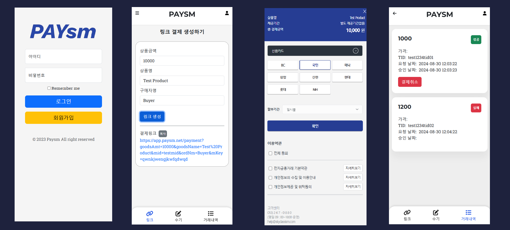

<h1 align="center">
  <br>
  Paysm Payment Web App</a>
  <br>
 
</h1>


## Description

This is an intermediary payment app that was commissioned to be produced by a previous company.

### <a href="https://paysm.net">Paysm Payment App</a>

<br>


## What is this app?

This is an intermediate payment web app created using an existing PG service.




## Getting Started

### Dependencies

* Chrome or Edge Browser
* Node.js
* NPM

### How To Run

To clone and run this application, you'll need [Git](https://git-scm.com) and [Node.js 18 or higher](https://nodejs.org/en/download/package-manager)

```bash
# Clone this repository
$ git clone https://github.com/tsukemandev/react-payapp.git

# Go into the repository
$ cd react-payapp

# Run npm install
$ npm install

# Run wep app
$ npm start

```


## Technology Stack

* Bootstrap (HTML, CSS)
* Javascript 
* React.js ( React-route-dom )


